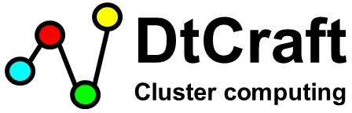

# What's DtCraft?
DtCraft is a general-purpose distributed programming system based on data-parallel streams. It offers a new powerful programming model called *stream graph* to build parallel and distributed workloads. Once an application is cast into this framework, the kernel transparently performs job distribution for you. You don't have to worry about system programming and can focus on high-level development!

| Unified Framework | Stream Graph |
| --------------- | ----------- |
|   |  |

Whether you are application developers or domain-specific engineers, you can use DtCraft for:

- Distributed computing
- Event-driven programming
- Network programming
- Data stream processing

To get your first DtCraft program up and running, visit <a href="https://tsung-wei-huang.github.io/DtCraft/quickstart.html">QuickStart</a> and <a href="https://tsung-wei-huang.github.io/DtCraft/write_the_first_dtcraft_program.html">Write the First DtCraft Program</a>.

# Design Goals
The goal of DtCraft is to help you write simple, easy, and effective code at cluster scale. The example below demonstrates a simple application to run two programs on two machines sending each other a message.

```cpp
#include <dtc/dtc.hpp>
  
using namespace std::literals;  // for the use of string literal
using namespace dtc::literals;  // for the use of memory literal

int main(int argc, char* argv[]) {

  dtc::Graph G;

  auto A = G.vertex();
  auto B = G.vertex();

  auto lambda = [] (dtc::Vertex& v, dtc::InputStream& is) {
    if(std::string s; is(s) != -1) {
      std::cout << "Received: " << s << '\n';
      return dtc::Event::REMOVE;
    }
    return dtc::Event::DEFAULT;
  };

  auto AB = G.stream(A, B).on(lambda);
  auto BA = G.stream(B, A).on(lambda); 

  A.on([&AB] (dtc::Vertex& v) { (*v.ostream(AB))("hello world from A"s); });  
  B.on([&BA] (dtc::Vertex& v) { (*v.ostream(BA))("hello world from B"s); });
  
  G.container().add(A).cpu(1).memory(1_GB);
  G.container().add(B).cpu(1).memory(1_GB);

  dtc::Executor(G).run();
}
```

There are myriads of cluster computing frameworks such as Hadoop MapReduce, Apache Spark, Dryad, and Ray. We believe each has its reason to exist. DtCraft targets at:

- **Programming model**. DtCraft leverages modern C++17 to offer a new programming model for cluster computing. Our model is very general and can implement most distributed computing patterns.

- **Performance**. DtCraft is designed completely from the ground up using advanced software techniques in order to deliver the best performance. 

- **Productivity**. DtCraft allows you to easily bring up a parallel and distributed workload in only a few lines of code. It takes only a few steps to set up a cluster to get things up and running.

# System Requirements
To install and run DtCraft, you only need the following:
- 64-bit Linux machine(s) with Kernel 3.8 or higher
- GNU C++ Compiler G++ v7.2 with -std=c++1z
- GNU Autotool (autoconf, automake, libtool)

# Learn More
+ <a href="https://tsung-wei-huang.github.io/DtCraft/">Official website</a>
+ <a href="https://tsung-wei-huang.github.io/DtCraft/">DtCraft TCAD18 paper</a>

# Get Involved
+ Report bugs/issues by submitting a <a href="https://github.com/twhuang-uiuc/DtCraft/issues">GitHub issue</a>.
+ Submit contributions using <a href="https://github.com/twhuang-uiuc/DtCraft/pulls">pull requests<a>.

